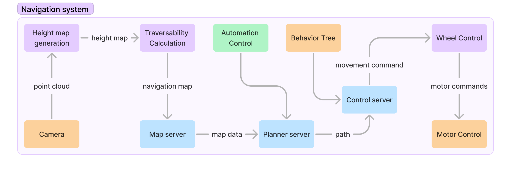

# Navigation
Below is a diagram describing the general design of the navigation system.

## Point cloud data

The rover uses the [zed2i](./hardware/depth_camera.md) to generate a 3d point cloud. A cloud is just a list of points with xyz coordinates.
### Height map

A point cloud is not the best data structure for mapping. It is inefficient for computation and is much more complicated and dense than we actually need. A height map is a 2d grid where each cell is assigned a height. For future processing, we convert the point cloud to a 2d height map representation ([pointcloud to heightmap](./software/traverse_layer.md#pointcloud-to-gridmap)). 

### Navigation Map

The navigation map or costmap is a 2d map representation of where the rover is allowed to drive. We calculate this map based on a [traversability calculation algorithm](./software/traverse_layer.md#traverse-map). 

### Map Server

To manage map data, which is useful for large maps, we have a map server. This stores the map data from the traversability calculation in memory. It downscales and outputs a large scale map used for long distance navigation. It also outputs a smaller, high resolution map for local navigation. The map server and traversability calculations are done in the same program. 

### Automation control

The automation is run by a simple script somewhere. In the case of the rover: it reads configuration stuff like waypoints and it manages scheduling of when actions should happen. The main way it interacts with the navigation system is by providing waypoints to the planner server.

### Planner Server

The planner server runs a path planner algorithm between the current position of the rover and a given target position.

### Control Server

The control server knows its current position, and the position it should be in next (the next point in its path). Based on that, it calculates the movement the rover needs to make based on its movement model (how is the rover physical capable of moving). 

### Wheel control

This part of the system is the glue between the software and hardware. It makes the movement commands describing what the rover needs to do and interfaces with motor control. The output of this stage is the target velocity that the motors should spin at. Implementation is in the [bodenbot package](./software/bodenbot.md#ros2control)

### [Motor Control](./hardware/motors.md)

This is the final stage of movement control, we use the target velocity and a PID loop to output a PWM and direction signal to the motors. 